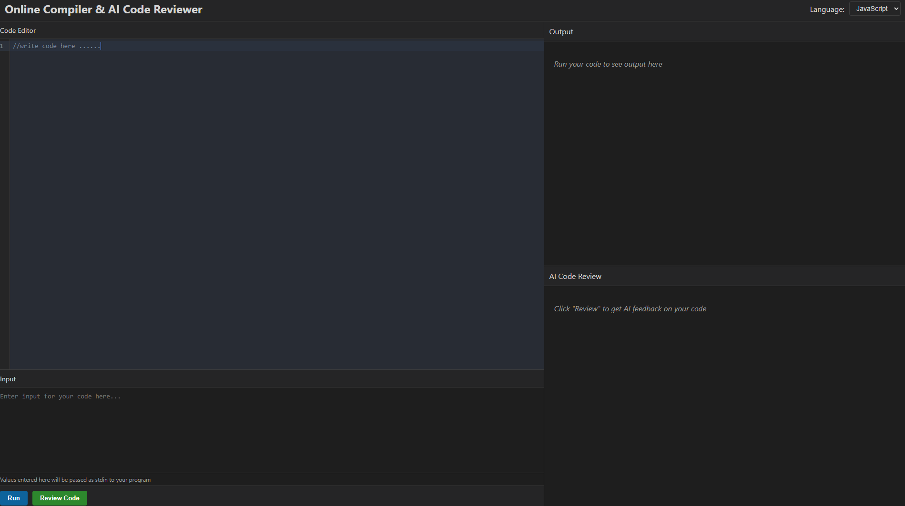

# ⚙️ Online Compiler & AI Code Reviewer

A full-stack web application to:
- ✅ Compile and run code in multiple languages (JavaScript, Python, C++)
- 🤖 Get instant AI-powered code feedback using **Google Gemini API**

Built using **React (Vite)** for frontend and **Node.js (Express)** for backend.

---

## 📸 Screenshots

### 💻 Editor


### 💻 Code Editor


### 🤖 AI Code Review


---

## 🧰 Tech Stack

- **Frontend:** React (Vite), Axios
- **Backend:** Node.js, Express, Child Process, Google Gemini API
- **Languages Supported:** JavaScript, Python, C++
- **Other:** UUID, FS, Spawn, dotenv

---

## 🚀 Features

- 🧑‍💻 Code editor with syntax highlighting
- 🧾 Compile code and view output instantly
- 🧠 AI-powered code feedback via Gemini
- 📥 Supports user input for programs (e.g., input(), cin >>)
- 🧼 Clean and simple UI

---

## 📦 Project Structure

```
root/
├── backend/
│   ├── controllers/
│   ├── routes/
│   ├── utils/
│   └── server.js
├── frontend/
│   ├── components/
│   ├── App.jsx
│   └── main.jsx
└── README.md
```

---

## 🛠️ Getting Started

### 1. Clone the Repository

```bash
git clone https://github.com/yourusername/online-compiler-gemini.git
cd online-compiler-gemini
```

### 2. Install Dependencies

**Backend**
```bash
cd backend
npm install
```

**Frontend**
```bash
cd ../frontend
npm install
```

### 3. Environment Variables

**Backend (`backend/.env`)**
```env
PORT=5000
GEMINI_API_KEY=your_gemini_api_key_here
```

**Frontend (`frontend/.env`)**
```env
VITE_BACKEND_URL=http://localhost:5000
```

### 4. Run the App

**Backend**
```bash
cd backend
npm run dev
```

**Frontend**
```bash
cd frontend
npm run dev
```

Open your browser: [http://localhost:5173](http://localhost:5173)

---

## 🧪 API Endpoints

### `/api/compile`

**POST**
```json
{
  "language": "py",
  "code": "a = input(); print(a)",
  "input": "Hello from input"
}
```
**Response**
```json
{
  "output": "Hello from input"
}
```

### `/api/review`

**POST**
```json
{
  "code": "def add(a, b): return a + b"
}
```
**Response**
```json
{
  "feedback": "Consider adding type hints and docstring for clarity."
}
```

---

## 📌 Future Improvements

- 🔐 Authentication for user sessions
- 🗂️ Code saving & history
- 📎 PDF export of review
- 🛠️ More language support: Java, Go, Rust
- 🌍 Deploy to Vercel + Render/Heroku

---

## 👨‍💻 Author

- **Your Name** – [Santanu Raj](https://github.com/santanu0101)
- 📧 santanuraj75@gmail.com

---


